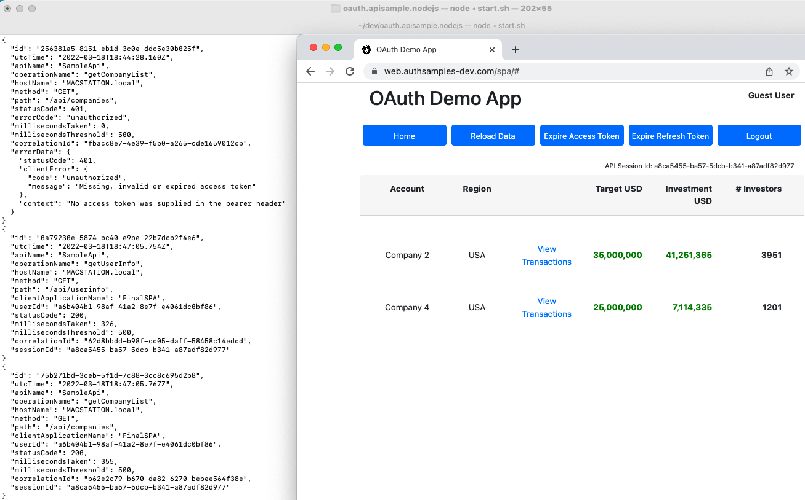
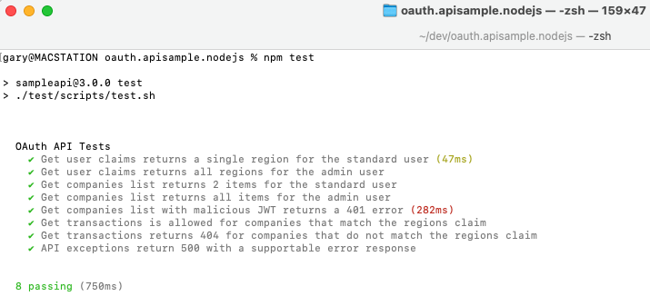

# Final OAuth Node.js API

 

## Overview

The final OAuth secured Node.js API code sample, referenced in my blog at https://authguidance.com:

* The API takes finer control over OAuth domain specific claims and uses a certified JOSE library
* The API uses JSON request logging and Elasticsearch log aggregation, for measurability

## API integrates with UI Clients

The API can run as part of an OAuth end-to-end setup, to server my blog's UI code samples.\
Running the API in this manner forces it to be consumer focused to its clients:

## API can be Productively Tested

The API's clients are UIs, which get user level access tokens by running an OpenID Connect code flow.\
For productive test driven development, the API instead mocks the Authorization Server:

## API can be Load Tested

A basic load test uses promises to fire 5 parallel requests at a time at the API.\
This ensures no concurrency problems, and error rehearsal is used to verify that the API is supportable:

## Further Details

* See the [Overview Page](https://authguidance.com/2017/10/27/api-architecture-node) for further details on running the API
* See the [Coding Key Points Page](https://authguidance.com/2017/10/27/final-nodeapi-coding-key-points/) for key implementation details
* See the [Non Functional Behaviour](https://authguidance.com/2017/10/08/corporate-code-sample-core-behavior/) page for a summary of overall qualities

## Programming Languages

* Node.js with TypeScript is used to implement the REST API

## Middleware Used

* Express is used to host the API over SSL
* AWS Cognito is used as the default Authorization Server
* The [JOSE Library](https://github.com/panva/jose) is used to manage in memory validation of JWTs
* [Inversify](http://inversify.io) is used to manage dependencies in line with other development languages
* API logs can be aggregated to [Elasticsearch](https://authguidance.com/2019/07/19/log-aggregation-setup/) to support [Query Use Cases](https://authguidance.com/2019/08/02/intelligent-api-platform-analysis/)
* The API is designed for [cloud native deployment](https://github.com/gary-archer/oauth.cloudnative.deployment) to Kubernetes
