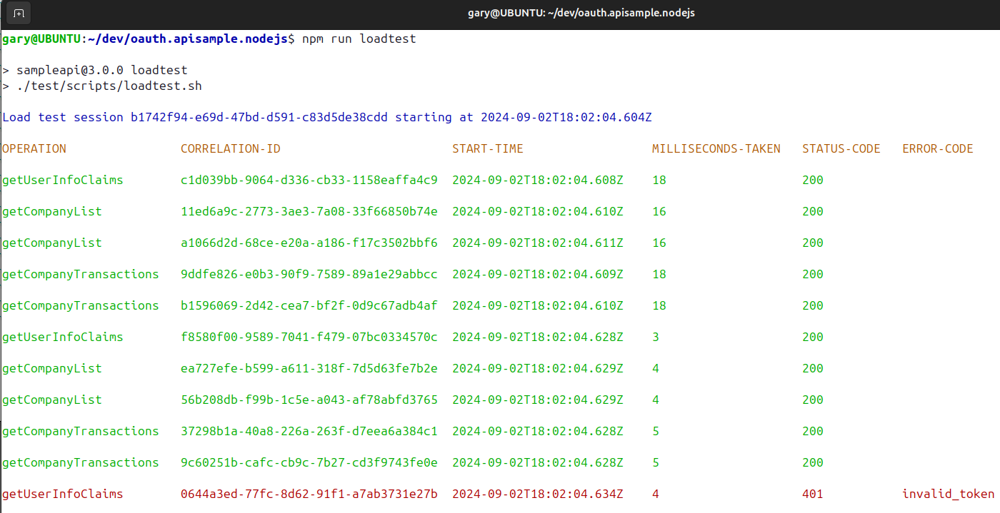

# Final OAuth Node.js API

[](https://app.codacy.com/gh/gary-archer/oauth.apisample.nodejs?utm_source=github.com&utm_medium=referral&utm_content=gary-archer/oauth.apisample.nodejs&utm_campaign=Badge_Grade)

[](https://snyk.io/test/github/gary-archer/oauth.apisample.nodejs?targetFile=package.json)

## Behaviour

The final OAuth secured Node.js API code sample, which returns mock `investments` data:

- The API takes finer control over claims-based authorization to enable security with good manageability.
- The API uses structured logging and log aggregation, for the best supportability.

### API integrates with UI Clients

The API can run as part of an OAuth end-to-end setup, to serve my blog's UI code samples.\
Running the API in this manner forces it to be consumer-focused to its clients:


### API can be Productively Tested

The API's clients are UIs, which get user-level access tokens by running an OpenID Connect code flow.\
For productive test-driven development, the API instead mocks the authorization server:


### API can be Load Tested

A basic load test uses promises to fire 5 parallel requests at a time at the API.\
This ensures no concurrency problems, and tests use error rehearsal to ensure useful client responses and logs:



### API is Supportable

You can aggregate API logs to Elasticsearch and run [Technical Support Queries](https://apisandclients.com/posts/api-technical-support-analysis).


## Commands

### Prerequisites

- Install Node.js 20+.
- Also install Docker to run integration tests that use Wiremock.

### Run the API

Run the API with this command:

```bash
./start.sh
```

### Configure DNS and SSL

Configure DNS by adding these domains to your hosts file:

```text
127.0.0.1 localhost api.authsamples-dev.com login.authsamples-dev.com
```

Then call an endpoint over port 446:

```bash
curl -k https://api.authsamples-dev.com:446/investments/companies
```

By default, SSL trust is managed by setting a `NODE_EXTRA_CA_CERTS` environment variable.\
This points to the development root CA downloaded to `./certs/authsamples-dev.ca.crt`.\
If you have an existing trust file, you will need to the add this certificate to it.

### Test the API

Stop the API, then re-run it with a test configuration:

```bash
npm run testsetup
```

Then run integration tests and a load test:

```bash
npm test
npm run loadtest
```

## Further Details

* See the [API Journey - Server Side](https://apisandclients.com/posts/api-journey-server-side) for further information on the API's behaviour.
* See the [Overview Page](https://apisandclients.com/posts/api-architecture-node) for further details on how to run the API.
* See the [Code Overview](https://apisandclients.com/posts/final-nodeapi-coding-key-points) for some implementation details.

## Programming Languages

* The API uses Node.js and TypeScript.

## Infrastructure

* Express is the HTTP server that hosts the API endpoints.
* AWS Cognito is the API's default authorization server.
* The [jose](https://github.com/panva/jose) library manages in memory validation of JWTs.
* The project includes API deployment resources for Docker and Kubernetes.
