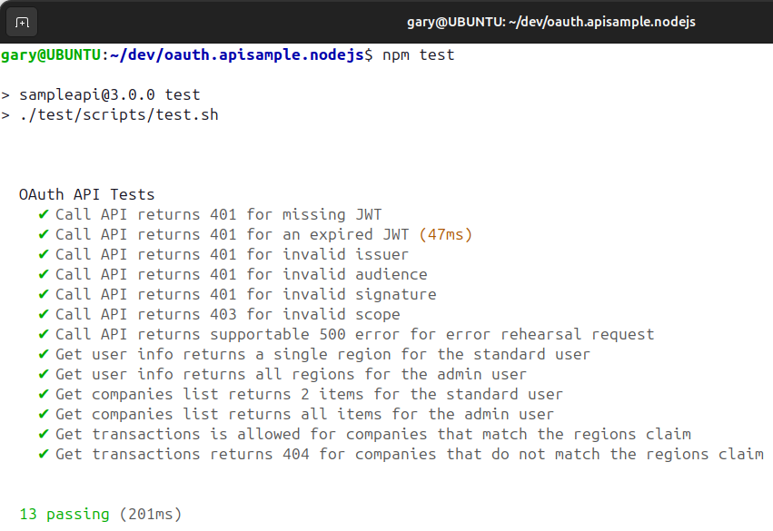

# Final OAuth Node.js API

[](https://www.codacy.com/gh/gary-archer/oauth.apisample.nodejs/dashboard?utm_source=github.com&amp;utm_medium=referral&amp;utm_content=gary-archer/oauth.apisample.nodejs&amp;utm_campaign=Badge_Grade) 

[](https://snyk.io/test/github/gary-archer/oauth.apisample.nodejs?targetFile=package.json)

## Behaviour

The final OAuth secured Node.js API code sample, referenced in my blog at https://authguidance.com:

- The API has a fictional business area of `investments`, but simply returns hard coded data
- The API takes finer control over OAuth domain specific claims and uses a certified JOSE library
- The API uses JSON request logging and Elasticsearch log aggregation, for measurability
- The API uses constructor injection with request scoped ClaimsPrincipal / LogEntry objects

### API integrates with UI Clients

The API can run as part of an OAuth end-to-end setup, to serve my blog's UI code samples.\
Running the API in this manner forces it to be consumer focused to its clients:


### API can be Productively Tested

The API's clients are UIs, which get user level access tokens by running an OpenID Connect code flow.\
For productive test driven development, the API instead mocks the Authorization Server:



### API can be Load Tested

A basic load test uses promises to fire 5 parallel requests at a time at the API.\
This ensures no concurrency problems, and error rehearsal is used to verify that the API is supportable:


### API is Supportable

API logs can be analysed in use case based manner by running Elasticsearch SQL and Lucene queries.\
Follow the [Technical Support Queries](https://authguidance.com/2019/08/02/intelligent-api-platform-analysis/) for some people friendly examples:


## Commands

### Prerequisites

- Ensure that Node.js 18 or later is installed
- To run Wiremock, also install a Java 17+ SDK

### Run the API

Run the API with this command:

```bash
./start.sh
```

### Configure DNS

Configure DNS by adding these domains to your hosts file:

```text
127.0.0.1 localhost apilocal.authsamples-dev.com login.authsamples-dev.com
```

Then call an endpoint over port 446:

```bash
curl -k https://apilocal.authsamples-dev.com:446/investments/companies
```

### Test the API

Stop the API, then re-run it with a test configuration:

```bash
npm run testsetup
```

Then run integration tests and a load test:

```bash
npm test
npm run loadtest
```

## Further Details

* See the [Overview Page](https://authguidance.com/2017/10/27/api-architecture-node) for further details on running the API in end-to-end setups
* See the [Coding Key Points Page](https://authguidance.com/2017/10/27/final-nodeapi-coding-key-points/) for key implementation details
* See the [API Platform Design](https://authguidance.com/api-platform-design/) for details on scaling the design to many APIs

## Programming Languages

* Node.js with TypeScript is used to implement the REST API

## Infrastructure

* Express is used to host the API over SSL
* AWS Cognito is used as the default Authorization Server
* The [JOSE Library](https://github.com/panva/jose) is used to manage in memory validation of JWTs
* [Inversify](http://inversify.io) is used to manage dependencies in line with other development languages
* The project includes API deployment resources for Docker and Kubernetes
